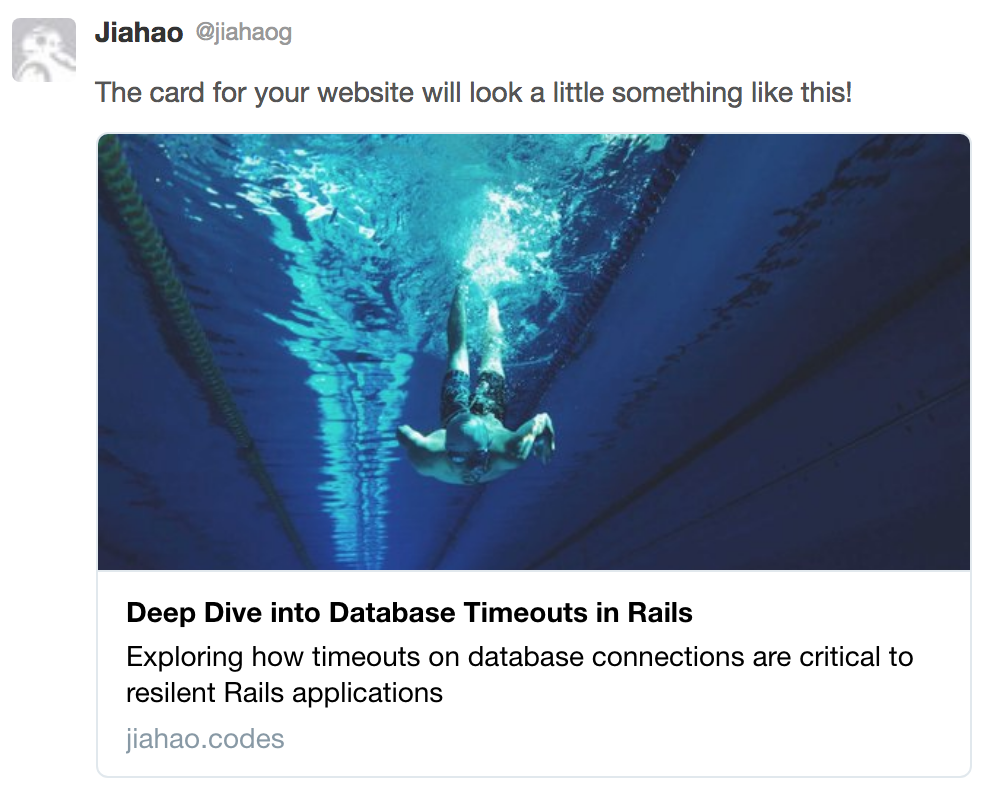
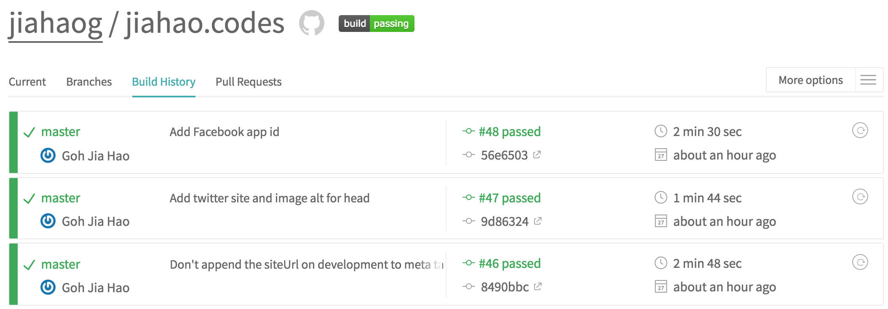
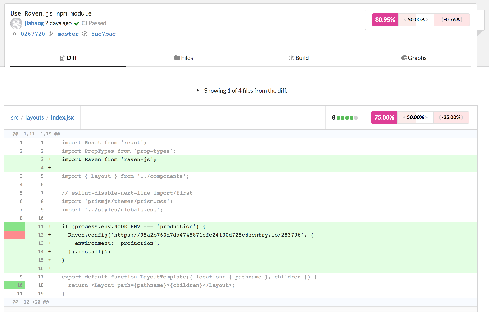
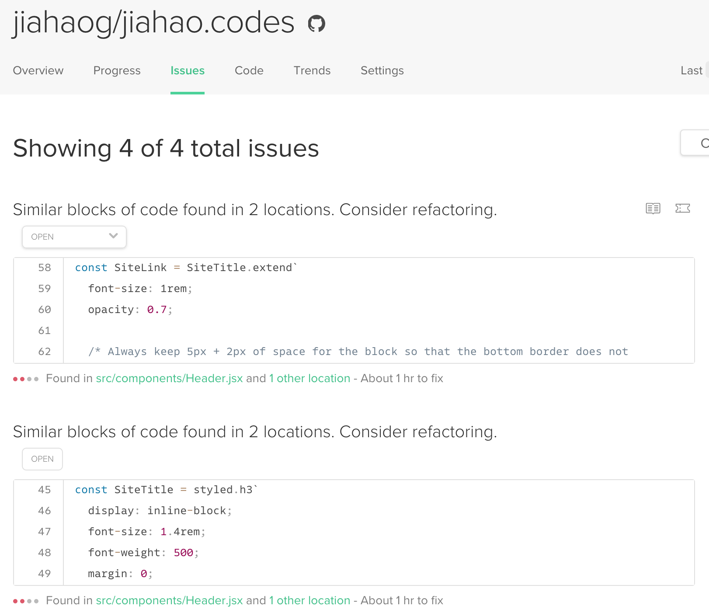
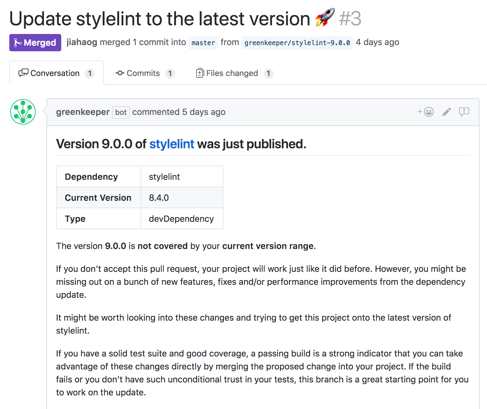
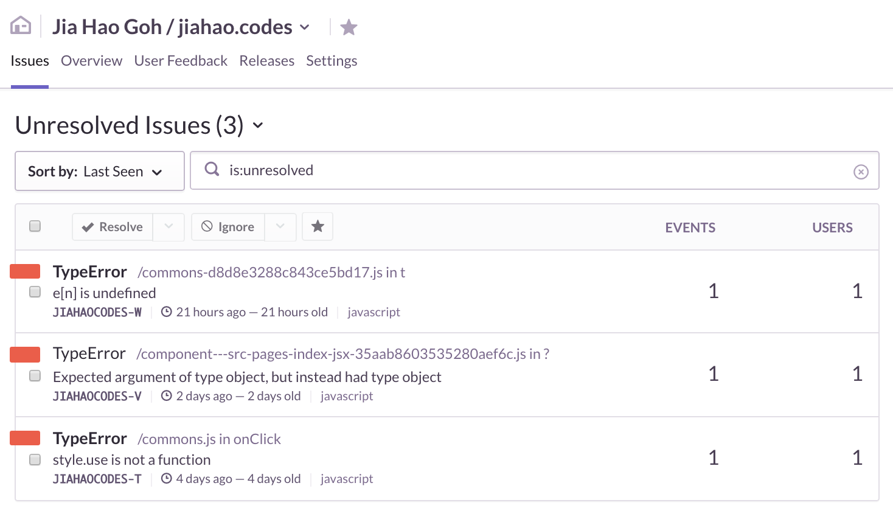

*This article is the second of a two part series, on the engineering behind my [website](https://jiahao.codes)*

To have beyond the best user experience possible, but also the most streamlined process possible when adding content such as blog posts, I ~~over-~~engineered my website to be a fully fledged production-ready progressive web app. I tried to integrate as many tools and automated pipelines as needed to ensure long maintainability of the codebase, and also to update myself on frontend web development. There needs to be separation of concerns between the code and the content, and adding new content should be as simple as possible without requiring a single line of Javascript code to be modified.

I'll talk about the following features and integrations set up in this article:

- [Progressive Web Application](#progressive-web-application-pwa)
- [Offline mode with Service Workers](#progressive-web-application-pwa)
- [Responsive images for all device types](#responsive-images)
- [Search Engine Optimization](#search-engine-optimization-seo)
- [Written with React in ES2015+ Javascript using the Gatsby framework](#the-new-website)
- [Styling with Styled Components and Typography.js](#styled-components)
- [ESLint and Stylelint code quality checks](#linting-rules)
- [Code formatting with Prettier](#code-formatting-with-prettier)
- [Continuous Integrations and Deployment pipelines](#continuous-integration)
- [Hosted at edge locations over a Content Delivery Network with Netlify](#continuous-deployment)
- [Monitoring with Sentry](#monitoring)

## Application Features

I started off with the [gatsby-starter-blog-no-styles](https://github.com/noahg/gatsby-starter-blog-no-styles) which was a minimal version of the [official starter blog](https://github.com/gatsbyjs/gatsby-starter-blog), and added on to it to build my website. section, I’ll go into the technical details of the features of the source code and application.

### Progressive Web Application (PWA)

[PWAs](https://developers.google.com/web/progressive-web-apps/) are web applications which behave like native applications on all devices, worthy of “a place on the user’s home screen”. Of course, this might be overkill for a simple website or blog, but why not build it with the features of a PWA if it gives speed and reliability? Gatsby already generates for us a basic PWA out of the box —  only the [offline](https://www.gatsbyjs.org/packages/gatsby-plugin-offline/) and [web manifest](https://www.gatsbyjs.org/packages/gatsby-plugin-manifest/) plugins need to be dropped in to complete it.

Offline support is provided using browser [Service Workers](https://developers.google.com/web/fundamentals/primers/service-workers/), allowing the site to function for returning visitors without an internet connection. It’s worth noting that this is [not fully supported](https://caniuse.com/#feat=serviceworkers) by all the browser vendors, such as Safari as of today. The good news is that it will arrive with [iOS 11.3](https://developer.apple.com/library/content/releasenotes/General/WhatsNewInSafari/Articles/Safari_11_1.html)!

### Search Engine Optimization (SEO)

I use the SEO term broadly here, including metadata annotations so that social media websites know how to display the content properly on their platform. It comes in a few forms:

#### [Google Structured Data](https://developers.google.com/search/docs/guides/intro-structured-data)

- For SEO and enhanced search

I’m still working on this part as it involves more work in understanding the [Schema.org](https://schema.org/) format to generate annotations automatically.

#### [Facebook’s Open Graph Protocol](http://ogp.me/)


*Example post when shared on Facebook*

#### [Twitter Cards](https://developer.twitter.com/en/docs/tweets/optimize-with-cards/overview/abouts-cards)


*Example post when shared on Twitter*

As I wanted the addition of new content to be entirely automated without having to modify any code, any metadata tags should be automatically generated for new pages. To do this, I took reference from the [SEO component](https://github.com/Vagr9K/gatsby-advanced-starter/blob/e8ed51ef9b7c3fcb28fa9b15e2b61c75e6b70757/src/components/SEO/SEO.jsx) of the [gatsby-advanced-starter](https://github.com/Vagr9K/gatsby-advanced-starter), to build a React component implementing the relevant metadata tags for our site pages in our document head.

I wired everything up, such that the frontmatter for a post will be automatically be processed and converted into the relevant `<meta />` tags in the document head. Take a look at the example of my first post at [`src/pages/blog/2018-01-22-hello-world/index.md`](https://github.com/jiahaog/jiahao.codes/blob/master/src/pages/blog/2018-01-22-hello-world/index.md).

```markdown
---
title: Hello Blog World!
date: 2018-01-22
path: /blog/hello-world/
excerpt: <code>console.log('Hello Blog World!');</code>
cover: ./cover.jpg
---

Content here...
```

The frontmatter (the portion enclosed within the `---` block) will be converted to the following tags in the document head:

```html
<!-- Document head at https://jiahao.codes/blog/hello-world/ simplified for brevity -->
<head>
  <title>Hello Blog World!</title>
  <meta name="description" content="<code>console.log('Hello Blog World!');</code>" >
  <meta name="image" content="https://jiahao.codes/static/cover-8c4020dc58b7d8763a6ba5ab6d6e587e-52613.jpg" >

  <!-- Google Structured Data -->
  <script type="application/ld+json" >
  [{ "@context": "http://schema.org", "@type": "WebSite", "url": "https://jiahao.codes", "name": "Jia Hao", "alternateName": "Jia Hao" }]
  </script>

  <!-- Facebook Open Graph -->
  <meta property="og:url" content="https://jiahao.codes/blog/hello-world/" >
  <meta property="og:type" content="article" >
  <meta property="og:title" content="Hello Blog World!" >
  <meta property="og:description" content="<code>console.log('Hello Blog World!');</code>" >
  <meta property="og:image" content="https://jiahao.codes/static/cover-8c4020dc58b7d8763a6ba5ab6d6e587e-52613.jpg" >
  <meta property="fb:app_id" content="" >

  <!-- Twitter Card -->
  <meta name="twitter:card" content="summary_large_image" >
  <meta name="twitter:site" content="@jiahaog" >
  <meta name="twitter:creator" content="@jiahaog" >
  <meta name="twitter:title" content="Hello Blog World!" >
  <meta name="twitter:description" content="<code>console.log('Hello Blog World!');</code>" >
  <meta name="twitter:image" content="https://jiahao.codes/static/cover-8c4020dc58b7d8763a6ba5ab6d6e587e-52613.jpg" >
</head>
```

I also wanted to point out the [React Helmet](https://github.com/nfl/react-helmet) library which makes modifying the document head a breeze with React APIs. Once again, there is a [Gatsby plugin](https://github.com/gatsbyjs/gatsby/tree/master/packages/gatsby-plugin-react-helmet) for this, supporting server-side rendering to add the correct tags into the static HTML output.

### Responsive Images

As I’ve discussed earlier above, delivering the optimal images for the correct devices is important to ensure that the site loads quickly and does not slow down when there are too many images on the page. A workflow is created so that images will automatically be resized into thumbnails of appropriate sizes, [Gatsby Image](https://github.com/gatsbyjs/gatsby/tree/00c4ca64a64233cb3e91dbf25e7f2c0dd928f82b/packages/gatsby-image) will use a “blur-up” technique to display a preview of the image while it loads, like how [Medium](https://medium.com/) displays images on articles. I won’t go into the details, but [this blog post](https://medium.com/@kyle.robert.gill/ridiculously-easy-image-optimization-with-gatsby-js-59d48e15db6e) provides an in-depth explanation of how to do so.

## Development

All Javascript is written in [ES2015+ syntax](https://github.com/tc39/proposals/blob/master/finished-proposals.md) and transpiled to ES5 for older browsers by [Babel](https://babeljs.io/). I also integrated many tools and libraries that make development easier.

### Styled Components

I really like the API of [Styled Components](https://www.styled-components.com/). It allows raw HTML tags to be “augmented” with styles as stateless components that can be reused, and composed together to build larger components. Take a look at the following component for my about page:

```jsx
import React from 'react';
import styled from 'styled-components';

import { GitHub, Twitter } from './svgs';

const SocialLinks = styled.div`
  text-align: right;
`;

// Simplified for brevity
export default function AboutPage({
  social: { githubUrl, twitterUrl },
}) {
  return (
    <div>
      <SocialLink href={githubUrl}>
        <GitHub />
      </SocialLink>
      <SocialLink href={twitterUrl}>
        <Twitter />
      </SocialLink>
    </div>
  );
}
```

Styled Components lets me create a `<div>` for my social icons styled with `text-align: right`, and reuse them as containers for the SVG icons. Class names will be automatically generated on a global stylesheet which will target these components when compiled.

Adapting this example from the [official documentation](https://www.styled-components.com/docs/basics#adapting-based-on-props), it’s even possible to create them with props with different properties.

```jsx{6}
import React from 'react';
import styled from 'styled-components';

const Button = styled.button`
  /* Adapt the colours based on primary prop */
  color: ${props => props.primary ? 'red' : 'white'};
`;

export default function Buttons() {
  return (
    <div>
      <Button>Normal</Button>
      <Button primary>Primary</Button>
    </div>
  );
}
```

Because of the ternary operator, the button with the `primary` attribute will have red text, while the other button will be white.

### Typography

Initially for styling, I wanted to start off with the tried and true [Bootstrap](https://getbootstrap.com/) as a base to build the application. However, the Gatsby tutorial [introduced me](https://www.gatsbyjs.org/tutorial/part-two/#typographyjs) to [Typography.js](http://kyleamathews.github.io/typography.js/), a great toolkit to add normalized styling to a website with readability in mind. I simply picked a [theme](https://github.com/KyleAMathews/typography.js/tree/master/packages/typography-theme-fairy-gates), tweaked the fonts and was rewarded with beautiful design for the page!

On top of using the library, I had to inject some [global markup](https://github.com/jiahaog/jiahao.codes/blob/master/src/styles/globals.css) myself to ensure that the HTML rendered from markup is pixel perfect. Minor changes needed to be made to the text colors, block quotes, to give the site some flavor.

For syntax highlighting in code blocks, a theme needs to be added as well. Symbols within the code were already broken down into spans with the appropriate classname annotations by the markdown transformer, but it’s still necessary to use drop in a CSS theme from [PrismJS](https://github.com/PrismJS/prism).

During this process of digging around the generated CSS, I realized how underlining text in CSS is not as trivial as it sounds. Compare the two anchor elements below. Which one looks better?


The text on the left is styled conventionally with `text-decoration: underline`. On the right, the styling is done with a combination of `background-image` to insert the thin line and `text-shadow`, adding the appearance of depth, making letters appear in front of the line. [This article](https://medium.design/crafting-link-underlines-on-medium-7c03a9274f9) goes into detail about how it is done on Medium — I never thought so much thought and effort went into making websites look *nice*.

It seems like the current implementation is still not perfect on the Safari browser, I'll have to fix this.

### Code formatting with Prettier

[Prettier](https://prettier.io/) is a code formatter to keep indentation, brackets, comma conventions and more standard in the codebase. By integrating it with [vim-prettier](https://github.com/prettier/vim-prettier), I configured my editor to automatically format my code when I save any files. It’s awesome and *life changing*. I remember after being pampered by Prettier and [Gofmt](https://golang.org/cmd/gofmt/), the code formatter for Go, I just had to find code formatters for other programming languages I use.

### Linting Rules

For linting, I use [ESLint](https://eslint.org/) configured to follow the [Airbnb Javascript style guide](https://github.com/airbnb/javascript) with the [React plugin](https://github.com/yannickcr/eslint-plugin-react). As far as possible, I tried to follow the [Airbnb React style guide](https://github.com/airbnb/javascript/tree/master/react) as well. CSS files are linted with [Stylelint](https://stylelint.io/), following their [standard rules](https://github.com/stylelint/stylelint-config-standard).

It took quite a bit of time to refactor the original project to follow these rules. It also turns out that since I’m using Prettier, I needed to use the [Prettier ESLint config](https://github.com/prettier/eslint-config-prettier) to turn off some of the rules. I didn’t know that at first and it took a bit of Googling to figure out.

### Tests

Most of my tests are written as snapshot tests, with the [Jest](https://facebook.github.io/jest/) test framework, and [Enzyme](https://github.com/airbnb/enzyme) to serialize the components. This is because there’s barely any logic in the code and the React components are all pure and stateless. It just adds a layer of security to ensure that code changes which cause the snapshots to break are noticed, for me to either update the snapshots or fix the breaking changes.

## Continuous Integration

Continuous integration means that automated processes are set up so that code checked into the remote Git repository are of quality and will not break when going to production. Typically, it involves running of tests when the remote is updated, so that breaking builds are detected and can be fixed quickly. With the multiple tools and services available *free* for open source projects, I was able to try some of them out, targeting different areas of code quality.

### Tests and Linting with Travis CI

[Travis CI](https://travis-ci.org/) is used to run linting and Javascript tests upon a `git push`.  This ensures that errors can be detected upon small deltas to the code. It’s better to fix them when they are found, instead of detecting them on production, or after large amounts of code have been added which can be a huge pain.


*[List of builds for the project](https://travis-ci.org/jiahaog/jiahao.codes/builds)*

### Coverage Visualization with Codecov

Coverage reports are sent to [Codecov](https://codecov.io/) at the end of the Travis CI builds, which provides a nice visualization of test coverage history [here](https://codecov.io/gh/jiahaog/jiahao.codes).


*Lines covered by tests in a commit*

It’s also especially useful in detecting lines of code which have not been covered by tests.

### Code Quality Insights with Code Climate

[Code Climate](https://codeclimate.com/) provides insights into code smells such as repeated code that could be refactored.


*Possible areas which can be refactored*

Issues are automatically created indicating areas that can be refactored. Check out the project [here](https://codeclimate.com/github/jiahaog/jiahao.codes).

### Dependency management with Greenkeeper and David DM

Keeping up-to-date with updates for dependencies is especially important in the Javascript world, be it for security fixes, bug fixes or new features. It’s usually easier to make small changes from time to time when there are breaking API changes with dependencies, rather than trying to make big updates and hoping nothing breaks.

[David](https://david-dm.org/) gives an [overview](https://david-dm.org/jiahaog/jiahao.codes) of dependencies to show them in a list and the possible versions that can be updated.

[Greenkeeper](https://greenkeeper.io/) automatically opens new pull requests to run tests when in-range npm dependencies have changed.


*Automatically opened [pull request](https://github.com/jiahaog/jiahao.codes/pull/3) by Greenkeeper to update Stylelint*

This means in the future, when I have less time to dedicate to this blog, I can just look at the pull requests indicating dependency updates, and simply click the merge button when my tests pass.

## Continuous Deployment

To keep development of the website as simple as possible, I wanted merging code to the `master` branch to automatically deploy the updated web application. Using a content delivery network (CDN) to serve the content means that content is hosted at edge locations closest to the visitor, to minimize latency when serving them up. As they are free, I looked at [GitHub Pages](https://pages.github.com/) and [Netlify](https://www.netlify.com/) to do this.

I used GitHub Pages in the past for the original iteration of the website. Previously, I ran a script manually on my local machine to perform the build locally and deploy them to the `gh-pages` remote branch, but this time I wanted it to be done remotely on a build server. GitHub Pages only allows you to do builds with a custom flavor of Jekyll, and I would have to set up my own pipeline to push the compiled web assets to the `gh-pages` branch.

That seemed like extra work, and Netlify doesn’t have these limitations. A build server is included for me — I just had to specify a build command and the directory for the output files.

In addition, it supports HTTP/2 over HTTPS with just a few clicks on the Netlify website. I only had to setup my DNS records for `jiahao.codes`, and everything was good to go. All that win for free!

This is important because HTTP/2 allows different required assets to be multiplexed over a single TCP connection, while HTTPS ensures that my website is delivered securely to users, preventing any ads or content being modified by any attackers. I learnt a lot about how these technologies work and matter in [High Performance Browser Networking](https://hpbn.co/) a book by Ilya Grigorik.

[Caching headers](https://developers.google.com/web/fundamentals/performance/optimizing-content-efficiency/http-caching) for the deployed static assets are also essential to minimize the number of network requests for returning visitors to the site. Netlify allows users to [define custom headers](https://www.netlify.com/docs/headers-and-basic-auth/#headers-and-basic-authentication) for this, which is helpfully available through… the [Gatsby Netlify plugin](https://github.com/gatsbyjs/gatsby/tree/a3fea82b4d4b4c644156e841401821933e8d694a/packages/gatsby-plugin-netlify) 🎉 !

## Monitoring

Once the website is in production at `https://jiahao.codes`, I needed a form of monitoring to ensure that the page functions correctly. [Sentry](https://sentry.io/welcome/) allows all client side Javascript errors to be reported remotely, and will appear on a dashboard as issues to be resolved, should there be any.


*Javascript errors as issues*

I also set up a private [Slack](https://slack.com/) workspace to receive notifications about my project. Not only will alerts from Sentry be sent there, but also build and deployment notifications will also appear there on a channel dedicated for this project. It’s not the most minimal way to do this — you can find a hundred and one complaints about how Electron apps like Slack are resource intensive, but since I’m always signed into another Slack workspace, it is pretty easy to just add another workspace to receive these notifications.


*My Slack channel showing build and deploy notifications*

## Future

I’m still making minor touches to the code before adding a new photography page to this site. I previously used [Storehouse](https://web.archive.org/web/20150611134241/https://www.storehouse.co/) (Wayback Machine link) to showcase them, but I’m sad to say that they have [shut down](https://techcrunch.com/2016/06/13/storehouse-will-shut-down-services-july-15-entire-team-will-migrate-to-square/). I’ll just have to build something similar then!

I’ve been also looking at [Netlify Content Management System (CMS)](https://www.netlifycms.org/) which can provide my site with a application to add new content from the browser directly, just like hosted versions of Wordpress.

## Summing Up

I'm very proud to say that setting up everything is completely free, from the libraries and frameworks used to the hosting of the site, thanks to open source. It may seem like overkill doing all that to setup a simple website, but I’ve really learnt a lot about what it takes to scaffold a modern day web application from scratch.

To be fair, I’m only standing on the shoulders of giants when I talk about all the amazing features and integrations above. Most of the work comes from hooking everything up and making sure everything works together nicely, ensuring that new content can be added seamlessly.

This reminds me of this webcomic:


*[xkcd/1319 - Automation](https://xkcd.com/1319/)*

**Original task**: Revamp my website to blog about things*

**Reality**: *Ongoing Development*

Hopefully this website will accompany me through my coding journey, inspiring to me to record down and share the things I’ve learnt. ~~Or I could start planning how to rewrite this in [GopherJS](https://github.com/gopherjs/gopherjs) / [Elm Lang](http://elm-lang.org/) / [Rust](https://www.rust-lang.org/en-US/) compiled to [WebAssembly](https://developer.mozilla.org/en-US/docs/WebAssembly).~~ Hmmm…

*Check out the source code [here](https://github.com/jiahaog/jiahao.codes)!*

## Acknowledgements

Many thanks to [Glen](https://github.com/glencbz) for reviewing this post, and [gilbarbara/logos](https://github.com/gilbarbara/logos) for the images in the cover image. SVG icons on this website are taken from [Font Awesome](https://fontawesome.com/).
