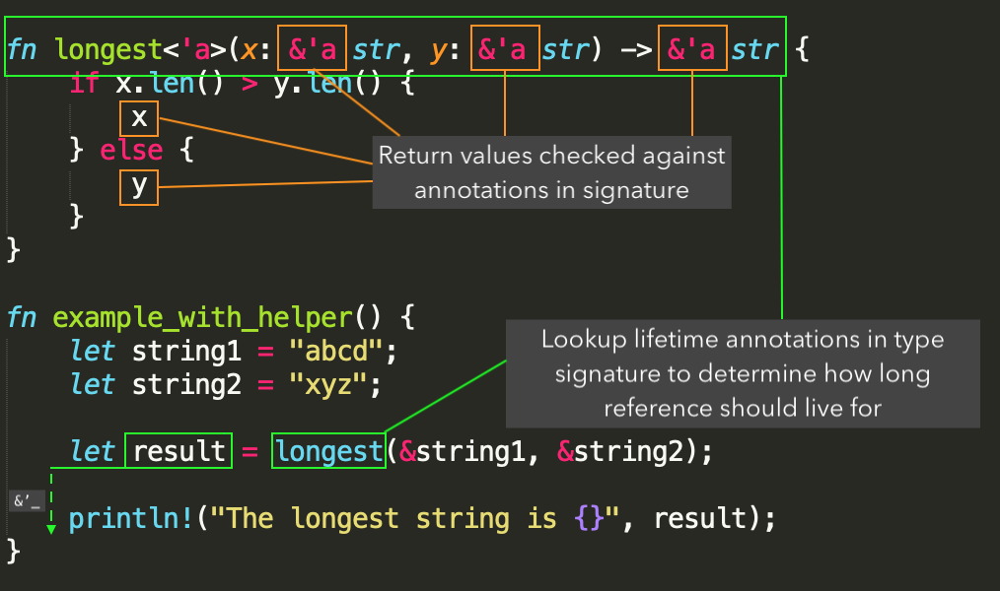

Being a beginner Rustacean, I’ve had the initial fear of the strange `'a` lifetime symbols appearing throughout Rust code. Having read the [documentation](https://doc.rust-lang.org/book/ch10-03-lifetime-syntax.html) many times, it still took me a while to reach this mental model of what they are. In this article, I break it down into two ways they are are used by the Rust compiler to check code for invalid references.

## Checking References Within Functions

Expanding a little on the [example](https://doc.rust-lang.org/book/ch10-03-lifetime-syntax.html#generic-lifetimes-in-functions) in the Rust book (I’d assume you read the chapter or none of this might make any sense), we have a function here that compares two strings and returns the longest.

```rust
fn example() {
    let string1 = "abcd";
    let string2 = "xyz";

    let result = if string1.len() > string2.len() {
        string1
    } else {
        string2
    };

    println!("The longest string is {}", result);
}
```

The borrow checker does its work within function blocks where statements are defined. To do this, it tracks the *lifetimes* of all variables in scope. For example, if we have a `consume` function to take ownership of a variable, the following will not compile:

```rust
fn consume<T>(_: T) {}

fn example_does_not_compile() {
    let string1 = "abcd";                              // ----+-- 'a
    let string2 = "xyz";                               // ----|----+-- 'b
                                                       //     |    |
    consume(string1);                                  // ----+    |
                                                       //          |
    let result = if string1.len() > string2.len() {    //          |
        string1                                        //          |
    } else {                                           //          |
        string2                                        //          |
    };                                                 //          |
                                                       //          |
    println!("The longest string is {}", result);      // ---------+
}
```

With the little annotations made in the comments above, we see that `string1` lives for up till `'a`, but is borrowed after that when `string1.len()` is called.

Lifetime annotations on function parameters are just helpers purely to help the compiler figure out how long the returned results should last. Consider the following code, where the conditional block has been abstracted into a function.

```rust
fn longest<'a>(x: &'a str, y: &'a str) -> &'a str {
    if x.len() > y.len() {
        x
    } else {
        y
    }
}

fn example_with_helper() {
    let string1 = "abcd";
    let string2 = "xyz";

    let result = longest(&string1, &string2);

    println!("The longest string is {}", result);
}
```

When the borrow checker reaches the `longest(&string1, &string2)` function call, it simply looks at the type signature of the `longest` function, together with the lifetime parameters, to decide how long the return value should live for. It *does not* recursively look into the contents of longest to decide if the parameters are valid at this point in time. This is why the annotations are needed on the function.

## Validation of Type Signature

Lifetime annotations are just another component of traditional function signatures, which are validated against the return value of the function as guardrails to fail quickly when compiling code.

For example, if you have a function with a type signature indicating a return value of `bool`, but instead choose to return another type, the code will fail to compile.

```rust
fn return_true() -> bool {
    1
}
```

```
error[E0308]: mismatched types
 --> src/lib.rs:2:5
  |
1 | fn return_true() -> bool {
  |                     ---- expected `bool` because of return type
2 |     1
  |     ^ expected bool, found integral variable
  |
  = note: expected type `bool`
             found type `{integer}`
```

Similarly, lifetime annotations are just another component of the function signature that is validated. Let’s go back to the `longest` function again, but in this case we change the returned `&’a str` to a new lifetime`&’b str`.

```rust
fn longest<'a, 'b>(x: &'a str, y: &'a str) -> &'b str {
    if x.len() > y.len() {
        x
    } else {
        y
    }
}
```

Take a moment to try and understand what this type definition means. By providing a different `'b` lifetime to the returned `&str`, we are telling the borrow checker that the reference returned does not have any relation to the input values. This also does not make sense – both `x` and `y` are *possible* return values of the function, but we have indicated that the returned lifetime `’b` is independent of `’a`. Hence, this does not compile anymore:

```
error[E0312]: lifetime of reference outlives lifetime of borrowed content...
  --> src/lib.rs:33:9
   |
33 |         x
   |         ^
   |
note: ...the reference is valid for the lifetime 'b as defined on the function body at 31:16...
  --> src/lib.rs:31:16
   |
31 | fn longest<'a, 'b>(x: &'a str, y: &'a str) -> &'b str {
   |                ^^
note: ...but the borrowed content is only valid for the lifetime 'a as defined on the function body at 31:12
  --> src/lib.rs:31:12
   |
31 | fn longest<'a, 'b>(x: &'a str, y: &'a str) -> &'b str {
   |            ^^

error: aborting due to previous error
```

These lifetime annotations are just a part of the function signature – lifetimes are checked just like how types are checked during compilation.

## Summary

On a high level, this is my mental model of how the borrow checker works:

```python
for function_declaration in program:
    verify_body(function_declaration.get_body())
    verify_type_signature(
        function_declaration.get_type_signature(),
        function_declaration.return_value())
```

Every function is checked in two ways to avoid dangling references:

1. `verify_body`: To validate that the function body has no invalid references
2. `verify_type_signature`: To check if the return value has the correct lifetimes that match the function signature

Hopefully the following will make some sense of the two ways they are used:



That’s all for now, I hope to keep this up and continue writing about Rust!
